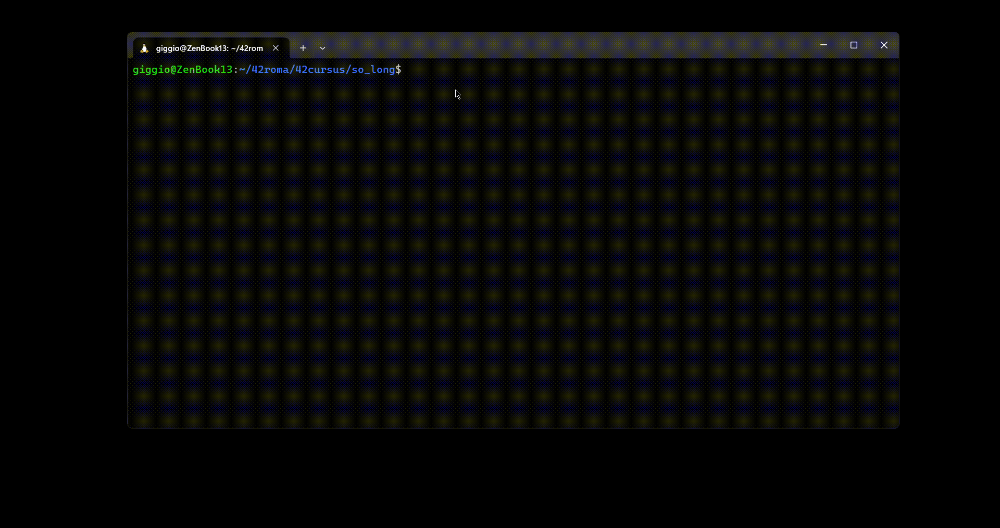

# SO_LONG

The goal of this project was to make a simple game in C where the PG can exit trough the scale when he takes all the coins on the map.  
The map where to play is created based on the map given as parameter.  

